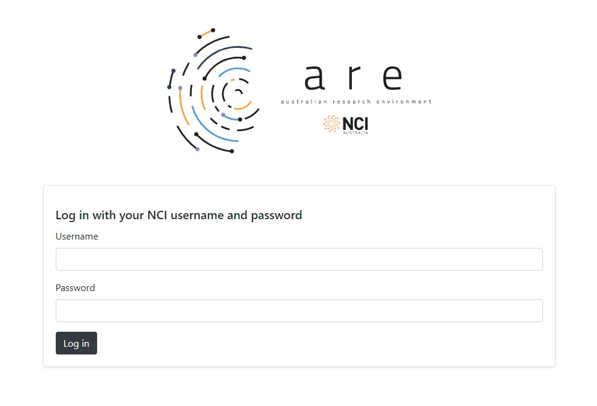
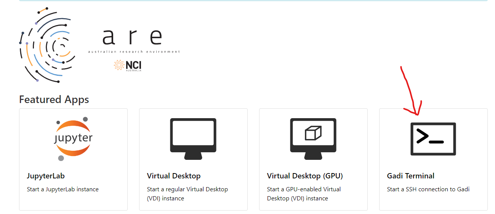

# Introduction to Gadi

## Learning Objectives 

* Logging in to Gadi via SSH or are@NCI's web terminal 
* Explore home, scratch, and gdata folder 
* Use software applications on Gadi 

* Run FastQC analysis on DNA sequencing data 
* Align reads to reference genome 
* 


## Logging in to Gadi

There are two ways to log in to Gadi, SSH and are@NCI's web terminal. 

__1. SSH__ 

When you created an account with NCI, you will be assigned a __username__. To logging into Gadi, we can run the ssh command in our local terminal.

```sh
ssh username@gadi.nci.org.au 
```

The password would be your NCI account password. Once the password is accepted, the ssh connection will be established on one of the ten Gadi login nodes.

__2. are@NCI's web terminal__

If you don't have a local terminal and SSH installed on your laptop. You can use are@NCI's web terminal tool to log into Gadi. 

Go to this [page](https://are.nci.org.au/) and use your NCI username and password to log in. 



After logging in, please click Gadi Terminal to start using Gadi. 



__Welcome Message:__

Once the connection is established, you will see a welcome message on your screen:

```
###############################################################################
#                  Welcome to the NCI National Facility!                      #
#      This service is for authorised clients only. It is a criminal          #
#      offence to:                                                            #
#                - Obtain access to data without permission                   #
#                - Damage, delete, alter or insert data without permission    #
#      Use of this system requires acceptance of the Conditions of Use        #
#      published at http://nci.org.au/users/nci-terms-and-conditions-access   #
###############################################################################
|         gadi.nci.org.au - 260,760 processor InfiniBand x86_64 cluster       |
===============================================================================

Oct 4 2022 Account Status Information on Login
   Whenever logging in from outside of Gadi, all users will now be presented
   with a brief summary about file expiry and projects near compute and/or
   storage quotas. This can be configured using the "login-info-conf" utility.
   For more information, please see https://opus.nci.org.au/x/HoABCw.

Mar 21 Sapphire Rapids Nodes Available
   An expansion to the CPU capacity of Gadi is now available with the addition
   of 720 Intel Xeon Sapphire Rapids nodes to Gadi. These nodes are available
   in the "normalsr" and "expresssr" queues.

   For more information, please see https://opus.nci.org.au/x/gIDAD
===============================================================================
Project a00 is at 97.79% of gdata inode capacity (580.71 K)
[us1234@gadi-login-05 ~]$ 
```

## Explore your `home`, `scratch`, and `gdata` directories

At login, your landing point is your home directory. You will see the tilde sign `~` before the command prompt indicating you are in your home directory. 

You can also use `pwd` to check what the full path of your home directory is. 

```sh
[us1234@gadi-login-05 ~]$ pwd
/home/001/us1234
```

There are 3 places where you can store your data on Gadi:

* Your home directory, which has 10 GiB storage.
* The `/scratch/project` directory, which has 72 GiB storage by default. Files not accessed for more than 100 days are automatically moved from project directories. 
* The `/g/data/project` directory, the amount of storage is set by the scheme manager. You can log in to [MyNCI](http://my.nci.org.au/) to check your project's allocation. 

__Let's go to the `/scratch` directory.__

```sh
cd /scratch 
ls
```

You should see results look like this:

```
public  project1  project2
```

The different directories belong to different projects. 

__Let's go to the `/g/data` directory.__

```sh
cd /g/data
ls
```

The result should look like this:

```
a01  a02  a03  a04  a05  a06  a07  a08  a09  a10  
a11  a12  a13  a14  a15  a16  a17  a18  a19  a20
```

The directories are belong to different projects, and if you have enrolled in a project, you should find your project directory here. The `training project` we enrolled in does not have a gdata folder so you won't find a directory here. 

__Check how much storage you have access to using `lquota`:__

```
[us1234@gadi-login-06 ~]$ lquota
--------------------------------------------------------------------------
           fs       Usage      Quota      Limit   iUsage   iQuota   iLimit
--------------------------------------------------------------------------
   a00 scratch 520.17 GiB   1.00 TiB   1.05 TiB     4531   369634   388115
   a01 scratch   2.11 TiB   5.00 TiB   5.25 TiB   948753 10485760 11010048
   a00   gdata   2.26 TiB   4.00 TiB   4.20 TiB   588867   600000   630000
--------------------------------------------------------------------------
```

Apart from storage limitation, there is also a quota called `iQuota` applied to the storage allocation on `/scratch` and `/g/data`. It sets the maximum number of files allowed in the project which `iUsage` shows the existing number of files and `iQuota` shows the file-number limit. 

__Checking personal usage on projects using `nci-files-report`:__

```
[us1234@gadi-login-03 ~]$ nci-files-report
------------------BREAKDOWN BY PROJECT, GROUP, AND USER-------------------
FILESYSTEM  SCAN DATE   PROJECT  GROUP  USER    SPACE USED  TOTAL SIZE  COUNT
scratch     2023-09-14  a00      a00    us1234      882.5M      882.5M  15
scratch     2023-09-14  a01      a01    us1234        8.0K        8.0K  2
--------------------------------------------------------------------------

------------------SUMMARIES-------------------
FILESYSTEM  USER    SPACE USED  TOTAL SIZE  COUNT
scratch     us1234      882.5M      882.5M  17
----------------------------------------------
```

It returns a summary of your usage on each project and on each folder. If you don't have any files created, it will return nothing. 

You can also use options to limit the results shown, try `nci-files-report -h` to learn more about the command. 

## Use software applications on Gadi 

Gadi has many software applications centrally installed and uses Environmental Modules to manage them. To run any of the them, we need to load the corresponding module first. If the application requires license, join the corresponding software group through [my.nci.org.au](my.nci.org.au). 

If the applications or packages you need are not centrally installed on Gadi, please contact [help@nci.org.au](https://nci.org.au/users/nci-helpdesk) to discuss whether it is suitable to install the missing ones centrally on Gadi. If it cannot be centrally installed, you can also contact the help desk to assist you to install it inside of your project folder. 

__Search for centrally installed applications:__ 

The command `module avail` prints out the complete list of software applications centrally available on Gadi. To look for a specific application, you can run `module avail app_name`. For example, we are going to use 3 different software for the variant calling workflow which are BWA, SAMtools, and BCFtools. We can try search them.

```
[us1234@gadi-login-06 ~]$ module avail bwa
----------------------------------------- /apps/Modules/modulefiles -----------------------------------------
bwa-mem2/2.2.1  bwa/0.7.17 
```

```sh
[us1234@gadi-login-06 ~]$ module avail samtools
----------------------------------------- /apps/Modules/modulefiles -----------------------------------------
samtools/1.9  samtools/1.10  samtools/1.12 
```

```sh
[us1234@gadi-login-06 ~]$ module avail bcftools
----------------------------------------- /apps/Modules/modulefiles -----------------------------------------
bcftools/1.9  bcftools/1.12  
```

All of the software we need are available on Gadi. 

__Running applications:__

Before running the application, we need to load the corresponding module by running `module load app_name/version`. For example, to load the applications we need in variant calling. 

```
[us1234@gadi-login-06 ~]$ module load bwa/0.7.17
[us1234@gadi-login-06 ~]$ bwa

Program: bwa (alignment via Burrows-Wheeler transformation)
Version: 0.7.17-r1188
Contact: Heng Li <lh3@sanger.ac.uk>

Usage:   bwa <command> [options]

Command: index         index sequences in the FASTA format
         mem           BWA-MEM algorithm
         fastmap       identify super-maximal exact matches
         pemerge       merge overlapping paired ends (EXPERIMENTAL)
         aln           gapped/ungapped alignment
         samse         generate alignment (single ended)
         sampe         generate alignment (paired ended)
         bwasw         BWA-SW for long queries

         shm           manage indices in shared memory
         fa2pac        convert FASTA to PAC format
         pac2bwt       generate BWT from PAC
         pac2bwtgen    alternative algorithm for generating BWT
         bwtupdate     update .bwt to the new format
         bwt2sa        generate SA from BWT and Occ

Note: To use BWA, you need to first index the genome with `bwa index'.
      There are three alignment algorithms in BWA: `mem', `bwasw', and
      `aln/samse/sampe'. If you are not sure which to use, try `bwa mem'
      first. Please `man ./bwa.1' for the manual.
```

```
[us1234@gadi-login-06 ~]$ module load samtools/1.9
[us1234@gadi-login-06 ~]$ samtools --version
samtools 1.9
Using htslib 1.9
Copyright (C) 2018 Genome Research Ltd.
```

```
[us1234@gadi-login-06 ~]$ module load bcftools/1.9
Loading bcftools/1.9
  Loading requirement: intel-mkl/2019.3.199 python2/2.7.16
[us1234@gadi-login-06 ~]$ bcftools --version
bcftools 1.9
Using htslib 1.9
Copyright (C) 2018 Genome Research Ltd.
License Expat: The MIT/Expat license
This is free software: you are free to change and redistribute it.
There is NO WARRANTY, to the extent permitted by law.
```

Here, we didn't actually run the software. Instead we tested if the commands are working. We will run the software on our sample data later when we create an interactive job session because the program would be killed if we run it directly in command line. 

__Check currently loaded modules:__

We can use `module list` command to check all currently loaded modules. 

```
[us1234@gadi-login-06 ~]$ module list
Currently Loaded Modulefiles:
 1) pbs   2) bwa/0.7.17   3) samtools/1.9   4) intel-mkl/2019.3.199   5) python2/2.7.16   6) bcftools/1.9
```

__Unload modules:__

To unload a module, we can run `module unload app_name`. When unloading a module, we don't need to specify the version number because two versions of the same application cannot be loaded at the same time. 

```
[us1234@gadi-login-08 ~]$ module unload bcftools
Unloading bcftools/1.9
  Unloading useless requirement: python2/2.7.16
[us1234@gadi-login-08 ~]$ module unload samtools
[us1234@gadi-login-08 ~]$ module unload bwa
```

We can run `module list` again to check currently loaded modules. 

```
[us1234@gadi-login-08 ~]$ module list
Currently Loaded Modulefiles:
 1) pbs   2) intel-mkl/2019.3.199 
```

## Submit jobs on Gadi 

There are generally two types of jobs. One is normal jobs where you can run simulation, modelling, and analysis tasks. The other one is copyq jobs where you can download, upload, and transfer data to and from Gadi, and it requires internet connection. 

__Normal Jobs:__

Here is an example job submission script to run FastQC analysis on 6 FASTQ files storing DNA sequencing data. 

```sh
#!/bin/bash
 
#PBS -l ncpus=2
#PBS -l mem=10GB
#PBS -l jobfs=10GB
#PBS -q normal
#PBS -P a00
#PBS -l walltime=02:00:00
#PBS -l storage=scratch/a00
#PBS -l wd
#PBS -M email_address
#PBS -m be 

mkdir -p /scratch/a00/us1234/fastqc-results/ 

module load fastqc/0.11.7 

fastqc -t 2 -o /scratch/a00/us1234/fastqc-results/ /scratch/a00/ANU-Bioinformatics-2023/data/*.fastq.gz 
```

Please create a new script `run_fastqc.sh` and input the code in. 

To submit the job, run `qsub run_fastqc.sh`. You will be prompted with a job number after submitting. 

In the script, we set up to receive an email when the job start running and when it finishes. After the job finishes, you can go into your output directory and check the result. 

__Transfer Data to and from Gadi:__

If you would like to download data from Gadi to your local computer. You can use the `scp` command in the command line. 

```sh
scp source destination
```

Let's download the HTML files from our FastQC analysis, and we can use the browser to look at the result. 

```sh
scp us1234@gadi.nci.org.au:/scratch/a00/us1234/fastqc-results/*.html .
```

You will be asked to fill in the password of your NCI account. 

```
us1234@gadi.nci.org.au's password:
```

After filling in the password, downloads will start automatically. 

```
SRR2584863_1.trim_fastqc.html                                                         100%  243KB  12.6MB/s   00:00
SRR2584863_2.trim_fastqc.html                                                         100%  246KB  14.1MB/s   00:00
SRR2584866_1.trim_fastqc.html                                                         100%  245KB  10.6MB/s   00:00
SRR2584866_2.trim_fastqc.html                                                         100%  244KB  12.8MB/s   00:00
SRR2589044_1.trim_fastqc.html                                                         100%  245KB  12.6MB/s   00:00
SRR2589044_2.trim_fastqc.html                                                         100%  246KB  14.9MB/s   00:00
```

Uploading files to Gadi works the same, simply put the local files as source and Gadi address as the destination:

```sh
scp /path/to/localfiles user@gadi.nci.org.au:/path/to/destination 
```

__Copyq Jobs:__

For transfer of bulk data (more than 500 GiB), it is recommended to do it by submitting a job in the queue of `copyq`. Because processes running on the login node will be terminated when reaching 30 minutes. Long software installations that require an internet connection are also recommended to be run inside copyq jobs. 

An example of copyq job submission script:

```sh
#!/bin/bash
 
#PBS -l ncpus=1
#PBS -l mem=2GB
#PBS -l jobfs=2GB
#PBS -q copyq
#PBS -P a00
#PBS -l walltime=02:00:00
#PBS -l storage=scratch/a00
#PBS -l wd
#PBS -M email_address
#PBS -m be 

cd /scratch/a00/us1234

curl -O ftp://ftp.sra.ebi.ac.uk/vol1/fastq/SRR258/004/SRR2589044/SRR2589044_1.fastq.gz
```

* `-l ncpus=1` to reserve 1 CPU for the job
* `-l mem=2GB` to reserve 2GB RAM 
* `-l jobfs=2GB` to reserve 2GB local disk storage on the hosting compute nodes
* `-q copyq` to run job in the copyq queue 
* `-P a00` to charge the job on project a00
* `-l walltime=02:00:00` set the time limit to 2 hours 
* `-l storage=scratch/a00` identifies the specific file systems that the job will need access to 
* `-l wd` entering the directory where the job was submitted at the start of the job 
* `-M email_address` the email address to which emails about the job will be sent 
* `-m be` specify what types of emails will be sent, `a` for job aborted, `b` for job begins execution, and `e` for job ends execution

__Interactive Jobs:__

It is recommended that users try their workflow on Gadi in an interative job before submitting the tasks as jobs. 

To submit an interactive job, run `qsub -I` on the login node. 

For example, to start an interative job on Gadi's normal queue through project a00 with the request of 8 CPU cores, 10 GiB memory, and 10 GiB local disk for 30 minutes, we can run:

```sh
qsub -I -qnormal -Pa00 -lwalltime=00:30:00,ncpus=8,mem=10GB,jobfs=10GB,storage=scratch/a00,wd
```

It may take some time for the job to start, you can tell the interactive job has been started by the prompt changing from `user@gadi-login-03 ~` to `user@gadi-cpu-clx-1274 ~`. It means we have moved from the login node to one of Gadi's compute nodes. 

Now, we will run a variant calling workflow step to step to test if the pipeline works properly. 

1. Load modules

These are the 3 software we need to run our workflow, let's load them all. 

```sh
cd /scratch/vp91/user1234
module load bwa/0.7.17
module load samtools/1.9
module load bcftools/1.9
```

2. Align reads to reference genome

```sh
bwa mem -t 8 /scratch/vp91/ANU-Bioinformatics-2023/ref-genome/ecoli_rel606.fa /scratch/vp91/ANU-Bioinformatics-2023/data/SRR2584863_1.trim.fastq.gz /scratch/vp91/ANU-Bioinformatics-2023/data/SRR2584863_1.trim.fastq.gz | samtools view -S -b > SRR2584863.aligned.bam
```

3. Sort the alignment

```sh
samtools sort -o SRR2584863.aligned.sorted.bam SRR2584863.aligned.bam
```

4. Caculate reads coverage

```sh
bcftools mpileup --threads 8 -O b -o SRR2584863_raw.bcf -f /scratch/vp91/ANU-Bioinformatics-2023/ref-genome/ecoli_rel606.fa SRR2584863.aligned.sorted.bam
```

5. Call the variants 

```sh
bcftools call --ploidy 1 -m -v -o SRR2584863_variants.vcf SRR2584863_raw.bcf
```

6. Filter the variants 

```sh
vcfutils.pl varFilter SRR2584863_variants.vcf > SRR2584863_final_variants.vcf
```

__Exit interactive jobs:__

When we finished testing, we can run `exit` in the command line to terminate the interactive job and go back to the login node. 

If all the steps work properly, we can write the codes into a script and submit to a job for the analyses. Normally, there are multiple samples we need to analyse and using loop to analyse all samples at once is necessary. 

## Run the variant-calling workflow 

Here, I put the codes together into a script and it can loop through all of our samples in the data folder. 


```sh
#!/bin/bash

#PBS -l ncpus=8
#PBS -l mem=10GB
#PBS -l jobfs=10GB
#PBS -q normal
#PBS -P vp91
#PBS -l walltime=01:00:00
#PBS -l storage=scratch/vp91
#PBS -l wd

module load bwa/0.7.17
module load samtools/1.9
module load bcftools/1.9

fastq_dir=/scratch/vp91/ANU-Bioinformatics-2023/data
genome=/scratch/vp91/ANU-Bioinformatics-2023/ref-genome/ecoli_rel606.fa
out_dir=/scratch/vp91/user1234/vc-results

mkdir -p $out_dir 

for i in ${fastq_dir}/*_1.trim.fastq.gz
do
        base=$(basename $i _1.trim.fastq.gz)
        fq1=${fastq_dir}/${base}_1.trim.fastq.gz
        fq2=${fastq_dir}/${base}_2.trim.fastq.gz

        echo "Aligning sample $base"

        bam=${out_dir}/${base}.aligned.bam
        sorted_bam=${out_dir}/${base}.aligned.sorted.bam

        bwa mem -t 8 $genome $fq1 $fq2 | samtools view -S -b > $bam
        samtools sort -o $sorted_bam $bam

        echo "Calling variants for sample $base"

        raw_bcf=${out_dir}/${base}_raw.bcf
        variants=${out_dir}/${base}_variants.vcf
        final_variants=${out_dir}/${base}_final_variants.vcf

        bcftools mpileup --threads 8 -O b -o $raw_bcf -f $genome $sorted_bam
        bcftools call --ploidy 1 -m -v -o $variants $raw_bcf
        vcfutils.pl varFilter $variants > $final_variants
done
```

Save and exit the script. 

__Submitting the job using `qsub`__:

```sh
qsub run_vc.sh 
```

## Checking your job status 


# References 

NCI User Guide - [0. Welcome to Gadi](https://opus.nci.org.au/display/Help/0.+Welcome+to+Gadi) 


